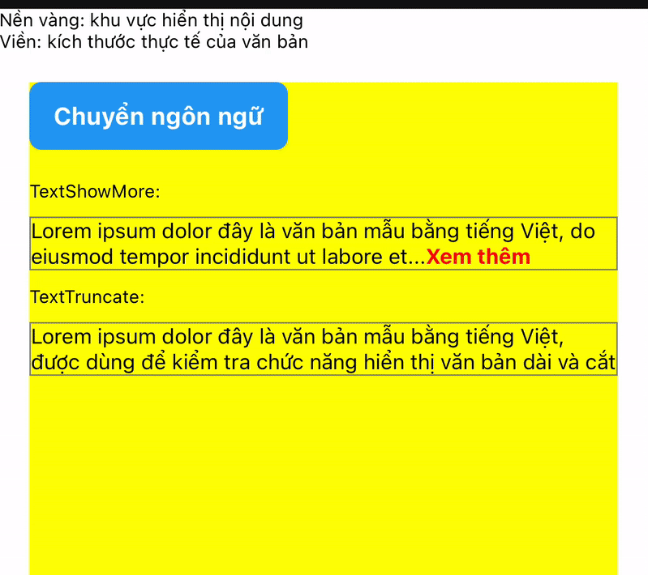

# @boindahood/text-truncate-show-more

  
A simple React Native component to truncate long text and toggle between "show more" / "show less".


## 📽 Demo Preview



  

## ✨ Features

  

- Truncate multi-line text with "Show more" button

- Toggle between expanded/collapsed state

- Fully customizable text and styles

- Automatically recalculate when using multiple languages

- Zero dependencies

  

## 📦 Installation

  

```bash

yarn add @boindahood/text-truncate-show-more

# or

npm install @boindahood/text-truncate-show-more

```

  

## ⚙️ Usage

  

```tsx

import { TextShowMore } from  '@boindahood/text-truncate-show-more';
import  React  from  'react';
import { View } from  'react-native';

export  default  function  MoreLess() {
const  longText  =  'Lorem ipsum dolor sit amet, consectetur adipiscing elit, sed do eiusmod tempor incididunt ut labore et dolore magna aliqua. Ut enim ad minim veniam, quis nostrud exercitation ullamco laboris nisi ut aliquip ex ea commodo consequat. Duis aute irure dolor in reprehenderit in voluptate velit esse cillum dolore eu fugiat nulla pariatur. Excepteur sint occaecat cupidatat non proident, sunt in culpa qui officia deserunt mollit anim id est laborum.';

return  <View>
{/* all props is optional, detail api below */}
<TextShowMore
numberOfLines={2}
textStyle={{ color:  'black' }}
textShowMore={'Show more'}
textShowMoreStyle={{ color:  'red' }}
textShowLess={'Show less'}
textShowLessStyle={{ color:  'blue' }}
>
{longText}
</TextShowMore>

<TextTruncate
numberOfLines={2}
style={{ color:  'black' }}
>
{longText}
</TextTruncate>
</View>
}

```

  

## 📘 Props

| Prop                | Type                     | Required | Default                  | Description                                                           |
|---------------------|--------------------------|:--------:|--------------------------|-----------------------------------------------------------------------|
| `children`          | `string`                 | No       | —                        | The text content to be displayed and truncated.                       |
| `textStyle`         | `StyleProp<TextStyle>`   | No       | `{ fontWeight: 'bold' }` | Custom style for the main text content.                               |
| `numberOfLines`     | `number`                 | No       | `undefined`              | Maximum number of lines to display before truncating the text.        |
| `textShowMore`      | `string`                 | No       | `"Show more"`            | Text displayed to expand the content.                                 |
| `textShowLess`      | `string`                 | No       | `"Show less"`            | Text displayed to collapse the content.                               |
| `textShowMoreStyle` | `StyleProp<TextStyle>`   | No       | `{ fontWeight: 'bold' }` | Custom style for the "Show More" text.                                |
| `textShowLessStyle` | `StyleProp<TextStyle>`   | No       | `{ fontWeight: 'bold' }` | Custom style for the "Show Less" text.                                |

  

## 🧪 Example Code

  

[](https://snack.expo.dev/@chubo274/react-native-text-truncate-show-more?platform=ios)

  

